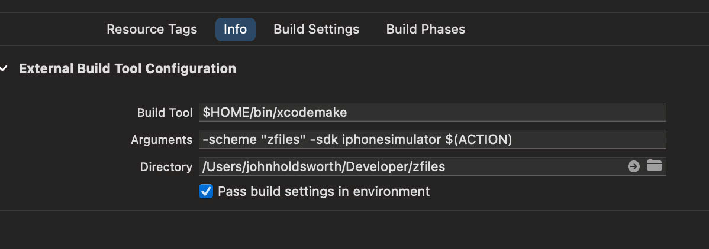

# ⚡️ xcodemake ⚡️ Faster `xcodebuilds` using "make".

`xcodemake` is a script that logs
xcodebuild output to generate a `Makefile` for an Xcode project.
Invoke the script with the arguments you would normally provide to
xcodebuild for a sucessfull build e.g. -scheme (target) and -sdk.
Once the Makefile has been generated you can use the "make" command 
for incremental builds which is generally considerably faster.
Note however, `xcodemake` only recompiles program source changes,
not resources or other binary aspects of an app bundle. You
can use xcodebuild for that or Xocde's internal build system
which shared the same file system.

It's intended for folks looking to build their project outside 
Xcode, for example, using extenal editors such as VSCode or Cursor.
When you use xcodebuild you're pretty much launching the entire
Xcode app from scratch in order to perform a each single build. 
Converting the build into a Makefile will be faster as make is 
exceptionally lightweight and while it elects not to capture
all dependencies between sources automatically it will always
recompile any source that has been edited.

If you're feeling adventurous you can use this script instead
of Xcode's build system itself by adding a target with type
"Other/External build system" something like the following:

To launch your application directly from this alternate build
system select "Other" and the executable from the file system 
directly in the scheme for the new target. If you encounter 
errors revert to the default Xcode build system, build then
try again. If you reorganise the files in the project the 
script should recapture the xcodemake\*.log files in your 
project root and the derived Makefile be regenerated.

If you replace `-sdk iphonesimulator` with `-sdk $(PLATFORM_NAME)`
you can use this "make" based build system for real devices.
The complication is that, as you need to select the binary
directly from the filesystem rather than from the menu in the
scheme it will not switch automatically and the error messages
if you forget to do this are not very helpful. You need 
to select it directly as otherwise it creates an implict 
dependency of the Xcode build and it will not be faster.
